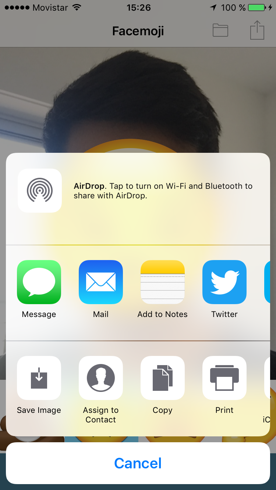

# Facemoji

## Introduction

This is a simple app that was created for an iOS introduction workshop.

## Features

* Splash image.
* Takes photos.
* Uses Core Image to get faces position and bounds.
* Simple UICollectionView.
* Literal colors and images.
* Storyboards and programmatic UI.
* Shares images.
* Saves images to photo library.
* UIView animated transitions.

## Screenshots

